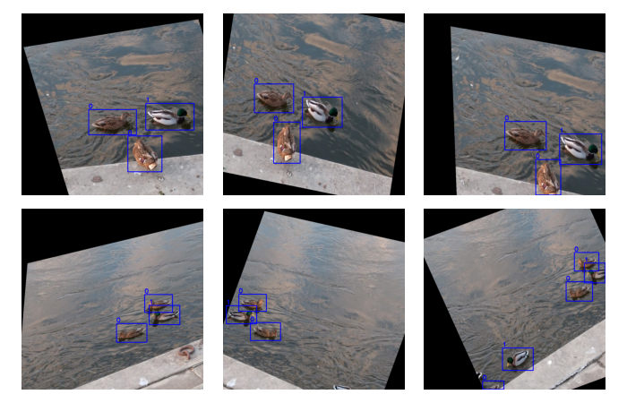

# Targetran

- Data augmentation library for object detection or image classification 
  model training. 
- Simple Python API to transform both the images and 
  the target rectangular bounding-boxes.
- Dataset-idiomatic implementation for TensorFlow and PyTorch.



(Figure produced by the example code [here](examples/run_tf_dataset_example.py).)

# Table of contents

- [Usage](#usage)
  - [Data format](#data-format)
  - [Design principles](#design-principles)
  - [TensorFlow Dataset](#tensorflow-dataset)
  - [PyTorch Dataset](#pytorch-dataset)
  - [Image classification](#image-classification)
  - [Examples](#examples)
- [API](#api)
  - [Overview](#overview)
    - [Transformation classes](#transformation-classes)
    - [Transformation functions](#transformation-functions)
  - [Full list](#full-list)
  - [Manual](#manual)

# Usage

## Data format

For object detection model training, which is the primary usage here, the following data are needed.
- `image_seq` (Sequence of `np.ndarray` or `tf.Tensor` of shape `(height, width, num_channels)`):
  - images in channel-last format;
  - image sizes can be different.
- `bboxes_seq` (Sequence of `np.ndarray` or `tf.Tensor` of shape `(num_bboxes_per_image, 4)`):
  - each `bboxes` array/tensor provides the bounding-boxes associated with an image;
  - each single bounding-box is given as `[top_left_x, top_left_y, bbox_width, bbox_height]`;
  - empty array/tensor means no bounding-boxes (and labels) for that image.
- `labels_seq` (Sequence of `np.ndarray` or `tf.Tensor` of shape `(num_bboxes_per_image,)`):
  - each `labels` array/tensor provides the bounding-box labels associated with an image;
  - empty array/tensor means no labels (and bounding-boxes) for that image.

Some dummy data are created below for illustration. Please note the required format.
```python
import numpy as np

# Each image could have different sizes, but they must follow the channel-last format, 
# i.e., (height, width, num_channels).
image_seq = [np.random.rand(480, 512, 3) for _ in range(3)]

# The bounding-boxes (bboxes) are given as a sequence of NumPy arrays (or TF tensors).
# Each array represents the bboxes for one corresponding image.
#
# Each bbox is given as [top_left_x, top_left_y, bbox_width, bbox_height].
# 
# In case an image has no bboxes, an empty array should be provided.
bboxes_seq = [
    np.array([  # Image with 2 bboxes.
        [214, 223, 10, 11],
        [345, 230, 21, 9],
    ]),
    np.array([]),  # Empty array for image with no bboxes.
    np.array([  # Image with 3 bboxes.
        [104, 151, 22, 10],
        [99, 132, 20, 15],
        [340, 220, 31, 12],
    ]),
]

# Labels for the bboxes are also given as a sequence of NumPy arrays (or TF tensors).
# The number of bboxes and labels should match. An empty array indicates no bboxes/labels.
labels_seq = [
    np.array([0, 1]),  # 2 labels.
    np.array([]),  # No labels.
    np.array([2, 3, 0]),  # 3 labels.
]

# During operation, all the data values will be converted to float32.
```

## Design principles

- Bounding-boxes will always be rectangular with sides parallel to the image frame.
- After transformation, each resulting bounding-box is determined by the smallest 
  rectangle (with sides parallel to the image frame) enclosing the original transformed bounding-box.
- After transformation, resulting bounding-boxes with their centroids outside the 
  image frame will be removed, together with the corresponding labels.

## TensorFlow Dataset

```python
import tensorflow as tf

from targetran.tf import (
    seqs_to_tf_dataset,
    TFCombineAffine,
    TFRandomFlipLeftRight,
    TFRandomFlipUpDown,    
    TFRandomRotate,
    TFRandomShear,
    TFRandomCrop,
    TFRandomTranslate,
    TFResize,
)

# Convert the above data sequences into a TensorFlow Dataset.
# Users can have their own way to create the Dataset, as long as for each iteration 
# it returns a tuple of tensors for a single sample: (image, bboxes, labels).
ds = seqs_to_tf_dataset(image_seq, bboxes_seq, labels_seq)

# The affine transformations can be combined for better performance.
# Note that cropping and resizing are not affine.
affine_transform = TFCombineAffine([
    TFRandomRotate(),
    TFRandomShear(),
    TFRandomTranslate(),
    TFRandomFlipLeftRight(),
    TFRandomFlipUpDown(),
])

# Typical application.
auto_tune = tf.data.AUTOTUNE
ds = ds \
    .map(TFRandomCrop(), num_parallel_calls=auto_tune) \
    .map(affine_transform, num_parallel_calls=auto_tune) \
    .map(TFResize((256, 256)), num_parallel_calls=auto_tune)

# In the Dataset `map` call, the parameter `num_parallel_calls` can be set to,
# e.g., tf.data.AUTOTUNE, for better performance. See docs for TensorFlow Dataset.
```
```python
# Batching:
# Since the array/tensor shape of each sample could be different, conventional
# way of batching may not work. Users will have to consider their own use cases.
# One possibly useful way is the padded-batch.
ds = ds.padded_batch(batch_size=2, padding_values=-1.0)
```

## PyTorch Dataset

```python
from typing import Optional, Sequence, Tuple

import numpy as np
from torch.utils.data import Dataset

from targetran.np import (
    CombineAffine,
    RandomFlipLeftRight,
    RandomFlipUpDown,
    RandomRotate,
    RandomShear,
    RandomCrop,
    RandomTranslate,
    Resize,
)
from targetran.utils import Compose


class PTDataset(Dataset):
    """
    A very simple PyTorch Dataset.
    As per common practice, transforms are done on NumPy arrays.
    """
    
    def __init__(
            self,
            image_seq: Sequence[np.ndarray],
            bboxes_seq: Sequence[np.ndarray],
            labels_seq: Sequence[np.ndarray],
            transforms: Optional[Compose]
    ) -> None:
        self.image_seq = image_seq
        self.bboxes_seq = bboxes_seq
        self.labels_seq = labels_seq
        self.transforms = transforms

    def __len__(self) -> int:
        return len(self.image_seq)

    def __getitem__(
            self,
            idx: int
    ) -> Tuple[np.ndarray, np.ndarray, np.ndarray]:
        if self.transforms:
            return self.transforms(
                self.image_seq[idx],
                self.bboxes_seq[idx],
                self.labels_seq[idx]
            )
        return (
            self.image_seq[idx],
            self.bboxes_seq[idx],
            self.labels_seq[idx]
        )


# The affine transformations can be combined for better performance.
# Note that cropping and resizing are not affine.
affine_transform = CombineAffine([
    RandomRotate(),
    RandomShear(),
    RandomTranslate(),
    RandomFlipLeftRight(),
    RandomFlipUpDown(),
])

# The `Compose` here is similar to that from the torchvision package, except 
# that here it also supports callables with multiple inputs and outputs needed
# for objection detection tasks, i.e., (image, bboxes, labels).
transforms = Compose([
    RandomCrop(),
    affine_transform,
    Resize((256, 256)),
])

# Convert the above data sequences into a PyTorch Dataset.
# Users can have their own way to create the Dataset, as long as for each iteration 
# it returns a tuple of arrays for a single sample: (image, bboxes, labels).
ds = PTDataset(image_seq, bboxes_seq, labels_seq, transforms=transforms)
```
```python
# Batching:
# In PyTorch, it is common to use a Dataset with a DataLoader, which provides
# batching functionality. However, since the array/tensor shape of each sample 
# could be different, the default batching may not work. Targetran provides
# a `collate_fn` that helps producing batches of (image_seq, bboxes_seq, labels_seq).
from torch.utils.data import DataLoader
from targetran.utils import collate_fn

data_loader = DataLoader(ds, batch_size=2, collate_fn=collate_fn)
```

## Image classification

While the tools here are primarily designed for object detection tasks, they can 
also be used for image classification in which only the images are to be transformed,
e.g., given a dataset that returns `(image, label)` samples, or even only `image` samples. 
The `image_only` function can be used to convert a transformation class for this purpose.

If the dataset returns a tuple `(image, ...)` duration iteration, only the `image`
will be transformed, other parameters that followed such as `(..., label, weight)` 
will be returned untouched.

If the dataset returns `image` only (not a tuple), then only the transformed `image` will be returned. 
```python
from targetran.utils import image_only
```
```python
# TensorFlow.
ds = ds \
    .map(image_only(TFRandomCrop())) \
    .map(image_only(affine_transform)) \
    .map(image_only(TFResize((256, 256))))
```
```python
# PyTorch.
transforms = Compose([
    image_only(RandomCrop()),
    image_only(affine_transform),
    image_only(Resize((256, 256))),
])
ds = PTDataset(..., transforms=transforms)
```

## Examples

See [here](examples) for example codes.

# API

## Overview

There are three modules: the NumPy transformation tools are from `targetran.np`,
the TensorFlow transformation tools are from `targetran.tf`, and some general
helper utilities are from `targetran.utils`.

### Transformation classes

Each transformation class comes in a pair, with one operating 
on `np.ndarray` and the other on `tf.Tensor`. For the latter, the class names 
have a `TF*` prefix, e.g., `RandomRotate` and `TFRandomRotate`.

The transformation classes are callables that accept input parameters from 
a single sample consists of:

- `image` (`np.ndarray` or `tf.Tensor` of shape `(height, width, num_channels)`);
- `bboxes` (`np.ndarray` or `tf.Tensor` of shape `(num_bboxes_per_image, 4)`, can be empty), 
  where each row is `[top_left_x, top_left_y, bbox_width, bbox_height]`;
- `labels` (`np.ndarray` or `tf.Tensor` of shape `(num_bboxes_per_image,)`, can be empty).

The return format is a tuple: `(image, bboxes, labels)`.

Please see the [data format](#data-format) section for usage instructions.

### Transformation functions

Each transformation class also has a pure functional counterpart, 
e.g., `rotate` and `tf_rotate` for `np.ndarray` and `tf.Tensor`, 
to which one could provide exact transformation parameters.

The input format is `(image, bboxes, labels, ...)` where each function
expects different additional input parameters. The return format is still
`(image, bboxes, labels)`.


## Full list

`targetran.np`
- [`RandomFlipLeftRight`](#randomflipleftright-tfrandomflipleftright)
- [`RandomFlipUpDown`](#randomflipupdown-tfrandomflipupdown)
- [`RandomRotate`](#randomrotate-tfrandomrotate)
- [`RandomShear`](#randomshear-tfrandomshear)
- [`RandomTranslate`](#randomtranslate-tfrandomtranslate)
- [`CombineAffine`](#combineaffine-tfcombineaffine)
- [`RandomCrop`](#randomcrop-tfrandomcrop)
- [`Resize`](#resize-tfresize)
- [`flip_left_right`](#flip_left_right-tf_flip_left_right)
- [`flip_up_down`](#flip_up_down-tf_flip_up_down)
- [`rotate`](#rotate-tf_rotate)
- [`shear`](#shear-tf_shear)
- [`translate`](#translate-tf_translate)
- [`crop`](#crop-tf_crop)
- [`resize`](#resize-tf_resize)

`targetran.tf`
- [`TFRandomFlipLeftRight`](#randomflipleftright-tfrandomflipleftright)
- [`TFRandomFlipUpDown`](#randomflipupdown-tfrandomflipupdown)
- [`TFRandomRotate`](#randomrotate-tfrandomrotate)
- [`TFRandomShear`](#randomshear-tfrandomshear)
- [`TFRandomTranslate`](#randomtranslate-tfrandomtranslate)
- [`TFCombineAffine`](#combineaffine-tfcombineaffine)
- [`TFRandomCrop`](#randomcrop-tfrandomcrop)
- [`TFResize`](#resize-tfresize)
- [`to_tf`](#to_tf)
- [`seqs_to_tf_dataset`](#seqs_to_tf_dataset)
- [`tf_flip_left_right`](#flip_left_right-tf_flip_left_right)
- [`tf_flip_up_down`](#flip_up_down-tf_flip_up_down)
- [`tf_rotate`](#rotate-tf_rotate)
- [`tf_shear`](#shear-tf_shear)
- [`tf_translate`](#translate-tf_translate)
- [`tf_crop`](#crop-tf_crop)
- [`tf_resize`](#resize-tf_resize)

`targetran.utils`
- [`Compose`](#compose)
- [`collate_fn`](#collate_fn)
- [`image_only`](#image_only)

## Manual

### `RandomFlipLeftRight`, `TFRandomFlipLeftRight`
Randomly flip the input image horizontally (left to right).
- `__init__` parameters
  - `probability` (`float`, default `0.7`): Probability to apply the transformation.
  - `seed` (`Optional[int]`, default `None`): Random seed.
- `__call__` parameters
  - `image`, `bboxes`, `labels`: Please refer to the [overview](#overview).
- `__call__` returns
  - Tuple of the transformed `(image`, `bboxes`, `labels)`.

### `RandomFlipUpDown`, `TFRandomFlipUpDown`
Randomly flip the input image vertically (up to down).
- `__init__` parameters
  - `probability` (`float`, default `0.7`): Probability to apply the transformation.
  - `seed` (`Optional[int]`, default `None`): Random seed.
- `__call__` parameters
  - `image`, `bboxes`, `labels`: Please refer to the [overview](#overview).
- `__call__` returns
  - Tuple of the transformed `(image`, `bboxes`, `labels)`.

### `RandomRotate`, `TFRandomRotate`
Randomly rotate the input image about the centre.
- `__init__` parameters
  - `angle_deg_range` (`Tuple[float, float]`, default `(-15.0, 15.0)`):
    The lower and upper limits (both exclusive) of the rotation angle in degrees.
    Positive values means anti-clockwise, and vice versa. 
  - `probability` (`float`, default `0.7`): Probability to apply the transformation.
  - `seed` (`Optional[int]`, default `None`): Random seed.
- `__call__` parameters
  - `image`, `bboxes`, `labels`: Please refer to the [overview](#overview).
- `__call__` returns
  - Tuple of the transformed `(image`, `bboxes`, `labels)`.

### `RandomShear`, `TFRandomShear`
Randomly shear the input image horizontally about the centre.
- `__init__` parameters
  - `angle_deg_range` (`Tuple[float, float]`, default `(-15.0, 15.0)`):
    The lower and upper limits (both exclusive) of the shear angle in degrees.
    Positive values means anti-clockwise, and vice versa.
    Both values should be greater than `-90.0` and less than `90.0`.
  - `probability` (`float`, default `0.7`): Probability to apply the transformation.
  - `seed` (`Optional[int]`, default `None`): Random seed.
- `__call__` parameters
  - `image`, `bboxes`, `labels`: Please refer to the [overview](#overview).
- `__call__` returns
  - Tuple of the transformed `(image`, `bboxes`, `labels)`.
  
### `RandomTranslate`, `TFRandomTranslate`
Randomly translate the input image.
- `__init__` parameters
  - `translate_height_fraction_range` (`Tuple[float, float]`, default `(-0.2, 0.2)`):
    The lower and upper limits (both exclusive) of the vertical translation, 
    given as fractions of the image height. 
    Both values should be greater than `-1.0` and less than `1.0`.
  - `translate_width_fraction_range` (`Tuple[float, float]`, default `(-0.2, 0.2)`):
      The lower and upper limits (both exclusive) of the horizontal translation, 
      given as fractions of the image width. 
      Both values should be greater than `-1.0` and less than `1.0`.
  - `probability` (`float`, default `0.7`): Probability to apply the transformation.
  - `seed` (`Optional[int]`, default `None`): Random seed.
- `__call__` parameters
  - `image`, `bboxes`, `labels`: Please refer to the [overview](#overview).
- `__call__` returns
  - Tuple of the transformed `(image`, `bboxes`, `labels)`.

### `CombineAffine`, `TFCombineAffine`
Combine the random affine transformations to improve performance.
- `__init__` parameters
  - `transforms` (Sequence of affine transform class objects): Accepted options are from below.
    - `RandomFlipLeftRight`/`TFRandomFlipLeftRight`
    - `RandomFlipUpDown`/`TFRandomFlipUpDown`
    - `RandomRotate`/`TFRandomRotate`
    - `RandomShear`/`TFRandomShear`
    - `RandomTranslate`/`TFRandomTranslate`
  - `probability` (`float`, default `0.7`): Probability to apply the combined transformation.
  - `seed` (`Optional[int]`, default `None`): Random seed.
- `__call__` parameters
  - `image`, `bboxes`, `labels`: Please refer to the [overview](#overview).
- `__call__` returns
  - Tuple of the transformed `(image`, `bboxes`, `labels)`.

### `RandomCrop`, `TFRandomCrop`
Get a random crop of the input image.
- `__init__` parameters
  - `cropped_height_fraction_range` (`Tuple[float, float]`, default `(0.7, 0.9)`):
    The lower and upper limits (both exclusive) of the cropped image height, 
    given as fractions of the original image height. 
    Both values should be greater than `0.0` and less than `1.0`.
  - `cropped_width_fraction_range` (`Tuple[float, float]`, default `(0.7, 0.9)`):
      The lower and upper limits (both exclusive) of the cropped image width, 
      given as fractions of the original image width. 
      Both values should be greater than `0.0` and less than `1.0`.
  - `probability` (`float`, default `0.7`): Probability to apply the transformation.
  - `seed` (`Optional[int]`, default `None`): Random seed.
- `__call__` parameters
  - `image`, `bboxes`, `labels`: Please refer to the [overview](#overview).
- `__call__` returns
  - Tuple of the transformed `(image`, `bboxes`, `labels)`.

### `Resize`, `TFResize`
Resize the input image.
- `__init__` parameters
  - `dest_size` (`Tuple[int, int]`): Destination image size given as (height, width).
- `__call__` parameters
  - `image`, `bboxes`, `labels`: Please refer to the [overview](#overview).
- `__call__` returns
  - Tuple of the transformed `(image`, `bboxes`, `labels)`.

### `to_tf`
Convert array sequences to TensorFlow (eager) tensor sequences.
- Parameters
  - `image_seq`, `bboxes_seq`, `labels_seq`: Please refer to the [data format](#data-format).
- Returns
  - Tuple of tensors: `(image_seq, bboxes_seq, labels_seq)`.

### `seqs_to_tf_dataset`
Convert array sequences to a TensorFlow Dataset.
- Parameters
  - `image_seq`, `bboxes_seq`, `labels_seq`: Please refer to the [data format](#data-format).
- Returns
  - `tf.data.Dataset` instance.

### `flip_left_right`, `tf_flip_left_right`
Flip the input image horizontally (left to right).
- Parameters
  - `image`, `bboxes`, `labels`: Please refer to the [overview](#overview).
- Returns
  - Tuple of the transformed `(image`, `bboxes`, `labels)`.

### `flip_up_down`, `tf_flip_up_down`
Flip the input image vertically (up to down).
- Parameters
  - `image`, `bboxes`, `labels`: Please refer to the [overview](#overview).
- Returns
  - Tuple of the transformed `(image`, `bboxes`, `labels)`.

### `rotate`, `tf_rotate`
Rotate the input image about the centre.
- Parameters
  - `image`, `bboxes`, `labels`: Please refer to the [overview](#overview).
  - `angle_deg` (`float`): Rotation angle in degrees. 
    A positive value means anti-clockwise, and vice versa.
- Returns
  - Tuple of the transformed `(image`, `bboxes`, `labels)`.

### `shear`, `tf_shear`
Shear the input image horizontally about the centre.
- Parameters
  - `image`, `bboxes`, `labels`: Please refer to the [overview](#overview).
  - `angle_deg` (`float`): 
    Shear angle in degrees, must be greater than `-90.0` and less than `90.0`. 
    A positive value means anti-clockwise, and vice versa.
- Returns
  - Tuple of the transformed `(image`, `bboxes`, `labels)`.
  
### `translate`, `tf_translate`
Translate the input image.
- Parameters
  - `image`, `bboxes`, `labels`: Please refer to the [overview](#overview).
  - `translate_height` (`int`): Vertical translation in pixels,
    with its absolute value smaller than the image height.
    A positive value means moving downwards, and vice versa.
  - `translate_width` (`int`): Horizontal translation in pixels.
    with its absolute value smaller than the image width.
    A positive value means moving rightwards, and vice versa.
- Returns
  - Tuple of the transformed `(image`, `bboxes`, `labels)`.
  
### `crop`, `tf_crop`
Get a crop of the input image.
- Parameters
  - `image`, `bboxes`, `labels`: Please refer to the [overview](#overview).
  - `offset_height` (`int`): Offset height of the cropped image in pixels,
    must be greater than `0` and less than the image height.
  - `offset_width` (`int`): Offset width of the cropped image in pixels,
    must be greater than `0` and less than the image width.
  - `cropped_image_height` (`int`): 
    In pixels, naturally bounded by the original image height.
  - `cropped_image_width` (`int`): 
    In pixels, naturally bounded by the original image width.
- Returns
  - Tuple of the transformed `(image`, `bboxes`, `labels)`.

### `resize`, `tf_resize`
Resize the input image. The same as `Resize`/`TFResize` but in functional form.
- Parameters
  - `image`, `bboxes`, `labels`: Please refer to the [overview](#overview).
  - `dest_size` (`Tuple[int, int]`): Destination image size given as (height, width).
- Returns
  - Tuple of the transformed `(image`, `bboxes`, `labels)`.

### `Compose`
Make a composition of the given callables.
- `__init__` parameters
  - `fns`: Sequence of callables that have the same input and return format, 
    e.g., the transformation classes.
- `__call__` parameters
  - Same format as the given callables.
- `__call__` returns
  - Same format as the given callables.

### `collate_fn`
To be used with the `DataLoader` from PyTorch for batching.
- Parameters
  - `batch`: Sequence of tuples.
- Returns
  - Tuple of sequences.

### `image_only`
Convert a transformation class to transform the input image only,
mainly for [image classification](#image-classification).
- Parameters
  - `tran_fn`: Transformation class object.
- Returns
  - Callable that performs the given transformation only to the input image
    while returning other input parameters untouched.
